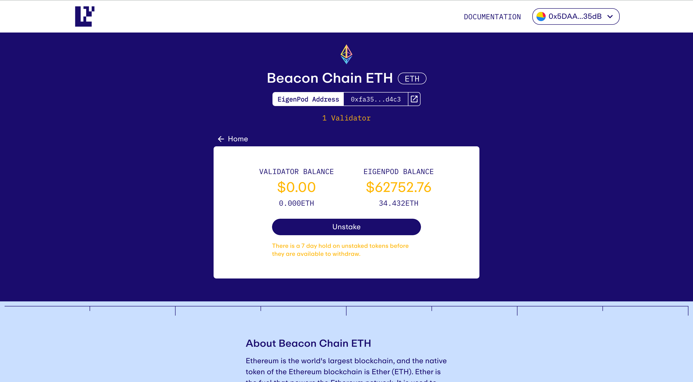
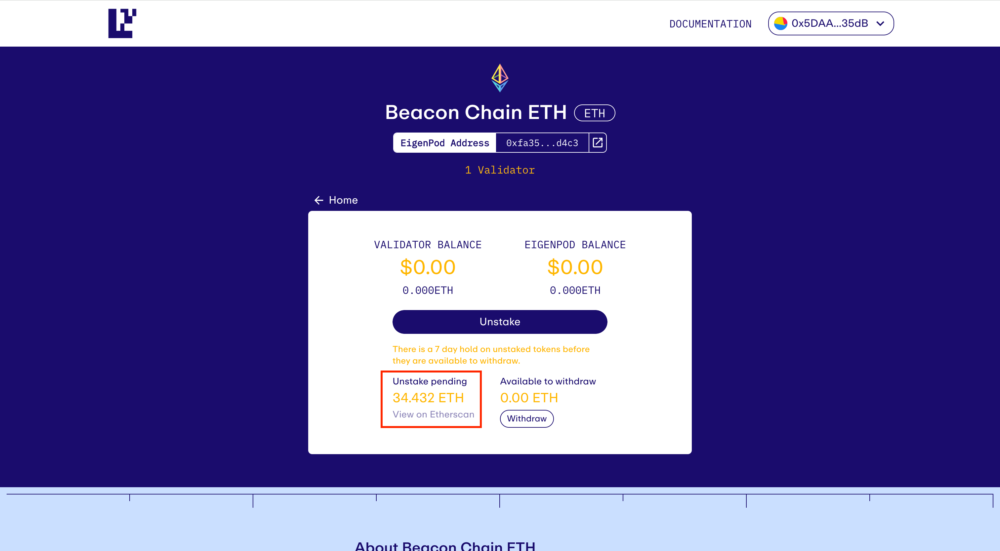
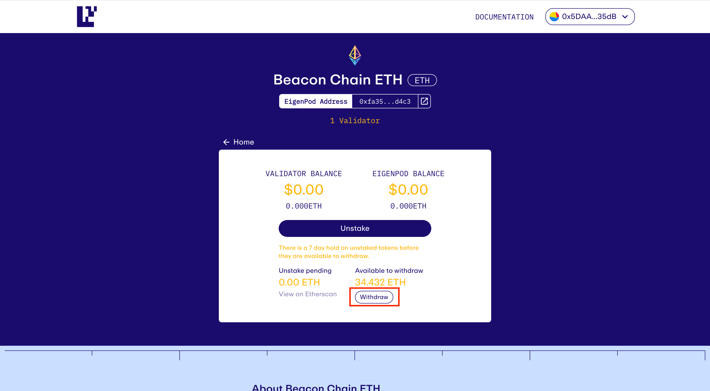
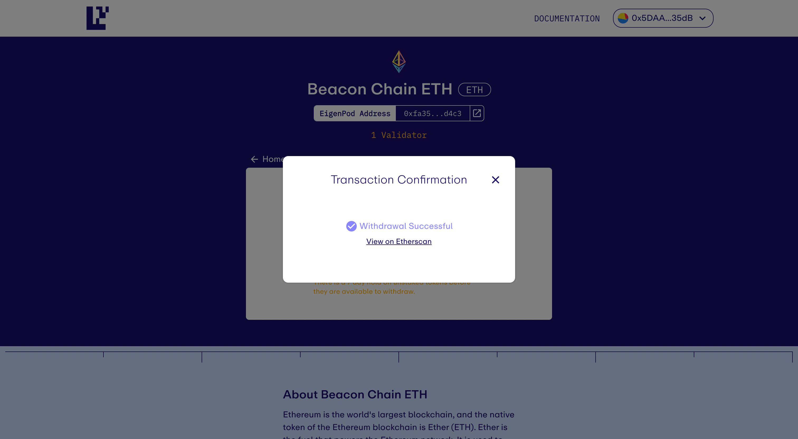

# Full Withdrawals

## This guide is intended to help you withdraw from Ethereum consensus and EigenLayer with 32ETH + staking rewards

:warning: **Warning:** Ensure you have already [repointed your withdrawal credentials](/restaking-guides/restaking-user-guide/native-restaking/repointing-a-validators-withdrawal-credentials) to your EigenPod.

:memo: All funds unstaked from EigenLayer go through a 7-day escrow period before being able to be withdrawn. Thus after you initiate your unstake, you must wait 7-days before being able to withdraw your assets.

### Step 1: Withdraw from Ethereum

First, [initiate a withdrawal](/restaking-guides/restaking-user-guide/native-restaking/withdrawal-flow/withdrawing-a-validator-from-consensus-layer) from your consensus client to your EigenPod contract.
LINKS TO THE CONSENSUS WITHDRAWAL PAGE

Once you withdraw from Ethereum, your staked ETH balance is credited to your EigenPod address and can be viewed on the EigenLayer app.

### Step 2: Unstake

Click **Unstake** to initiate the 7-day escrow period. Once the transaction confirms, you should see your EigenPod balance move to _Unstake pending_**:**

### Step 3: Withdraw

Upon completion of the 7-day escrow, click **Withdraw** to transfer the ETH to your wallet:

If successful, you should receive the following confirmation:

[← Withdraw from EigenLayer ..](./withdraw-from-eigenlayer.md)    [Withdraw from Consensus... →](./withdraw-validator-consensus-layer.md)
